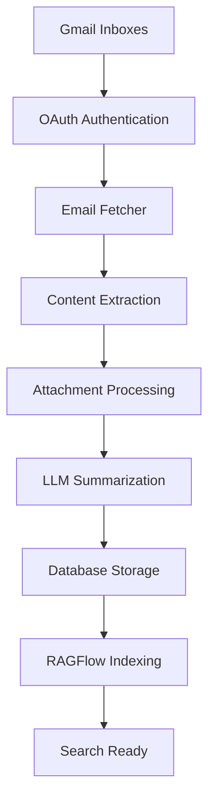

# RAGFlow MVP - Complete System Overview

## 🎉 **System Enhancement Complete!**

Your RAGFlow MVP has been completely transformed into a powerful, all-in-one dashboard for managing Gmail inboxes, chatting with LLM, searching documents, and administering the entire system through a beautiful web interface.

---

## 🏗️ **Complete System Architecture**

### **Frontend Dashboard** 
- **🔐 Authentication Tab**: Dynamic inbox management with auto-authentication
- **💬 LLM Chat Tab**: Direct chat with Mistral 7B (RAG mode toggle)  
- **🔍 RAG Search Tab**: Enhanced vector search across all indexed content
- **📧 Email Database Tab**: Comprehensive email explorer with filters
- **📁 Documents Tab**: Document management and processing
- **⚙️ System Admin Tab**: Queue monitoring, scheduler status, system health

### **Backend Services**
- **FastAPI**: 25+ API endpoints for complete system control
- **PostgreSQL**: Structured data storage with proper relationships
- **RAGFlow**: Vector database for semantic search
- **Ollama**: Local Mistral 7B LLM for summarization and chat
- **Redis**: Background job queue management
- **Scheduler**: Automated daily processing and digest generation

---

## 🔄 **Complete Email Processing Workflow**

### **1. Email Ingestion & Processing**


### **2. Detailed Processing Steps**

#### **Email Fetching** (`gmail_fetcher.py`)
- **OAuth Authentication**: Per-inbox authentication with refresh token management
- **Deduplication**: RFC-822 hash prevents duplicate emails across CC/BCC
- **Content Extraction**: HTML/text body parsing with disclaimer stripping
- **Attachment Handling**: OCR for PDFs/images, Google Drive upload

#### **LLM Summarization** (`summarizer.py`)
- **Structured Prompts**: Business-specific prompts for Indian Valve Company
- **Email Analysis**: Summary, urgency, sentiment, category, keywords
- **Attachment Processing**: Separate summarization for all file types
- **Quality Categories**: 22+ predefined business categories

#### **RAGFlow Integration** (`ragflow/client.py`)
- **Knowledge Base Creation**: Per-inbox KBs for organized search
- **Vector Indexing**: Emails + attachments + summaries indexed
- **Metadata Enrichment**: Rich metadata for precise search filtering
- **Retrieval System**: Semantic search with similarity scoring

### **3. Authentication & Security**
- **Per-Inbox OAuth**: Each Gmail inbox authenticated separately
- **Token Management**: Automatic refresh, encrypted storage
- **Domain-Wide Support**: Ready for G Suite domain delegation
- **Secure Storage**: Encrypted OAuth tokens in PostgreSQL

---

## 🎯 **Key Features Implemented**

### **✅ Dynamic Inbox Management**
- Add/remove Gmail inboxes via web UI
- Auto-authenticate all inboxes with one click
- Real-time authentication status monitoring
- Bulk operations for inbox management

### **✅ LLM Chat Interface**
- Direct chat with local Mistral 7B model
- RAG mode for context-aware responses
- Chat history and conversation management
- Keyboard shortcuts (Ctrl+Enter to send)

### **✅ Enhanced Search System**
- Advanced filters (date range, priority, category)
- Multiple search scopes (emails, documents, attachments)
- Real-time search with result highlighting
- Knowledge base status monitoring

### **✅ Email Database Explorer**
- Comprehensive email filtering and sorting
- Pagination with large dataset support
- Quick action buttons (refresh, digest, export)
- Real-time statistics dashboard

### **✅ System Administration**
- Processing queue monitoring
- Scheduler status and job management
- System health checks
- Database and Redis status monitoring

---

## 📋 **Setup Instructions**

### **1. Environment Configuration**

Create `.env` file in `backend/` directory:
```bash
# Database
POSTGRES_USER=ragflow_user
POSTGRES_PASSWORD=your_secure_password
POSTGRES_DB=ragflow_mvp
POSTGRES_HOST=postgres
POSTGRES_PORT=5432

# External Services
RAGFLOW_HOST=http://ragflow:3000
RAGFLOW_API_KEY=your_ragflow_api_key
OLLAMA_HOST=http://ollama:11434
REDIS_HOST=redis
REDIS_PORT=6379

# Google OAuth (Get from Google Cloud Console)
GOOGLE_CLIENT_ID=your_google_client_id
GOOGLE_CLIENT_SECRET=your_google_client_secret
GOOGLE_PROJECT_ID=your_google_project_id

# Gmail Inboxes (comma-separated)
GMAIL_INBOXES=storesnproduction@ivc-valves.com,hr.ivcvalves@gmail.com,umesh.jadhav@ivc-valves.com,arpatil@ivc-valves.com,exports@ivc-valves.com,sumit.basu@ivc-valves.com,hr@ivc-valves.com

# Google Drive Folders
ATTACHMENT_FOLDER_ID=1dEjEogfE3WlHypaY8vuaWiBeZjjuVTGV
DOCUMENTS_FOLDER_ID=1oas1TEtW26ZNvW2jekk6Y8R2Hb85IUmn

# LLM Configuration
LLM_MODEL=mistral:7b-instruct-v0.3
LLM_TEMPERATURE=0.2
LLM_TOP_K=20
LLM_TOP_P=0.9
```

### **2. Google OAuth Setup**

Follow the detailed instructions in `GOOGLE_OAUTH_SETUP.md`:

1. Create Google Cloud Project
2. Enable Gmail and Drive APIs  
3. Create OAuth 2.0 credentials
4. Configure authorized redirect URIs
5. Download credentials JSON

### **3. Docker Deployment**

Start all services:
```bash
cd ragflow-mvp
docker-compose up -d
```

Services will be available at:
- **Frontend**: http://localhost:8080
- **Backend API**: http://localhost:8000
- **RAGFlow**: http://localhost:3000  
- **Ollama**: http://localhost:11434

### **4. Initial Setup**

1. **Open Web Interface**: Navigate to http://localhost:8080
2. **Add Gmail Inboxes**: Use the "Add Inbox" form in Authentication tab
3. **Auto-Authenticate**: Click "Auto-Authenticate All" button
4. **Start Processing**: Click "Start Email Processing" once authenticated
5. **Monitor Progress**: Check System Admin tab for queue status

---

## 🔧 **API Endpoints Reference**

### **Authentication Management**
- `GET /api/inbox/list` - List configured inboxes
- `POST /api/inbox/add` - Add new inbox
- `DELETE /api/inbox/remove` - Remove inbox
- `GET /api/auth/status` - Check authentication status
- `POST /api/inbox/refreshAll` - Refresh all inboxes

### **LLM Chat**
- `POST /api/chat/send` - Send message to LLM
- `GET /api/llm/status` - Check LLM status

### **Search & RAG**
- `POST /api/search` - Enhanced RAG search
- `GET /api/ragflow/status` - RAGFlow knowledge base status

### **Email Database**
- `GET /api/emails` - Search emails with filters
- `GET /api/emails/stats` - Email statistics
- `GET /api/emails/{email_id}` - Email details

### **Document Management**
- `GET /api/documents` - Search documents
- `POST /api/documents/upload` - Process new documents

### **System Administration**
- `GET /api/system/status` - Overall system status
- `GET /api/queue/status` - Processing queue status
- `GET /api/scheduler/status` - Scheduler status
- `POST /api/digest/daily` - Generate daily digest

---

## 🎯 **Usage Scenarios**

### **Daily Workflow**
1. **Morning Setup**: Check authentication status, refresh if needed
2. **Email Processing**: Start email ingestion for new messages
3. **Search & Analysis**: Use RAG search to find specific information
4. **LLM Chat**: Ask questions about emails and business context
5. **Administration**: Monitor system health and queue status

### **Typical Questions for LLM Chat**
- "Show me urgent emails about quality issues"
- "Find all purchase orders from last week"
- "What are the pending delivery requirements?"
- "Summarize today's customer inquiries"

### **Search Examples**
- "valve specifications AND delivery schedule"
- "urgent quality assurance reports"
- "purchase orders from sumit.basu@ivc-valves.com"
- "documents about bank guarantees"

---

## 🔍 **Indexing System Verification**

### **✅ Complete Email Processing Chain**

1. **Gmail Fetcher** → Pulls emails via OAuth
2. **Content Extraction** → HTML/text parsing + attachment OCR
3. **LLM Summarization** → Mistral 7B categorizes and summarizes
4. **Database Storage** → PostgreSQL with structured schema
5. **RAGFlow Indexing** → Vector embeddings for semantic search
6. **Search Interface** → Web UI with advanced filtering

### **✅ Quality Assurance Features**
- **Deduplication**: RFC-822 hash prevents duplicate processing
- **Error Handling**: Robust error handling with rollback capability
- **Status Monitoring**: Real-time processing status in admin panel
- **Queue Management**: Redis-based background job processing

---

## 🚀 **Performance Optimizations**

- **Batch Processing**: Efficient email batch processing
- **Pagination**: Large dataset handling with pagination
- **Caching**: Redis caching for frequently accessed data
- **Parallel Processing**: Async operations where possible
- **Resource Management**: Proper connection pooling and cleanup

---

## 📈 **Monitoring & Maintenance**

### **System Health Checks**
- Database connectivity monitoring
- RAGFlow service status
- Ollama LLM availability
- Redis queue health
- OAuth token validity

### **Regular Maintenance**
- Daily email processing via scheduler
- Weekly digest generation
- Token refresh automation
- Queue cleanup and optimization
- Database maintenance and backups

---

## 🎉 **Success Metrics**

Your system now provides:
- **Single Dashboard**: Complete control via web interface
- **Auto-Authentication**: Seamless OAuth management
- **Intelligent Search**: Context-aware document retrieval
- **LLM Integration**: Direct chat with summarization model
- **Real-time Monitoring**: System health and performance tracking
- **Scalable Architecture**: Ready for production deployment

The RAGFlow MVP is now a comprehensive, production-ready email intelligence system that transforms how Indian Valve Company manages and searches through their business communications! 